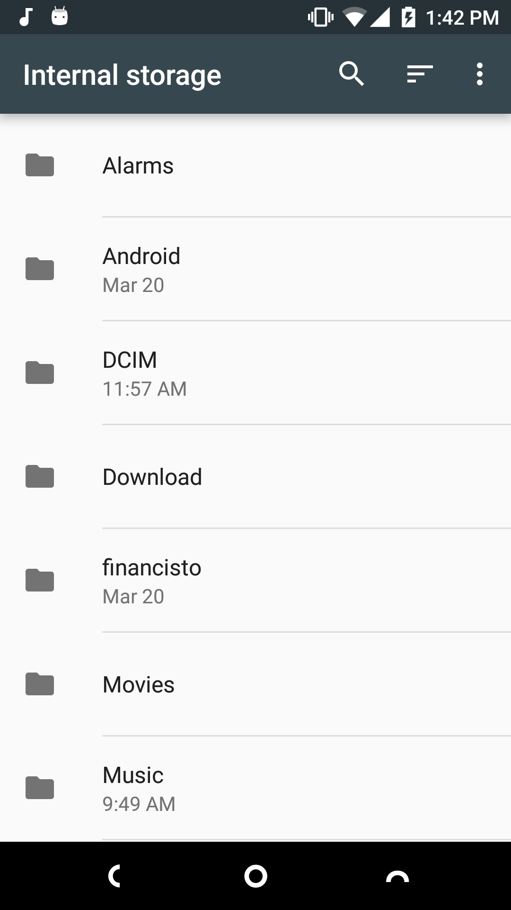
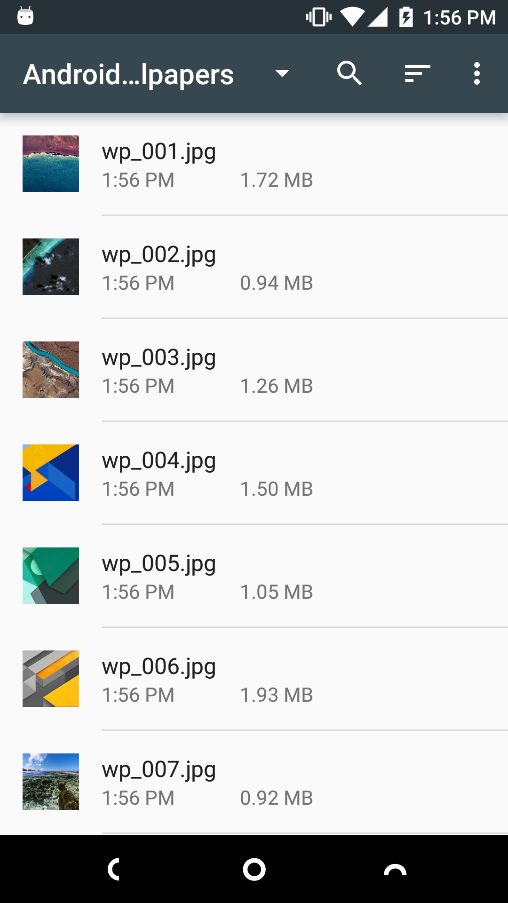

# File Explorer (Marshmallow & Nougat)

Android Marshmallow and Nougat has a simple built-in file explorer. But it can only be found from "Settings" -> "Storage & USB" -> "Explore". And some devices hide this feature.  
This app is a shortcut to open it.

